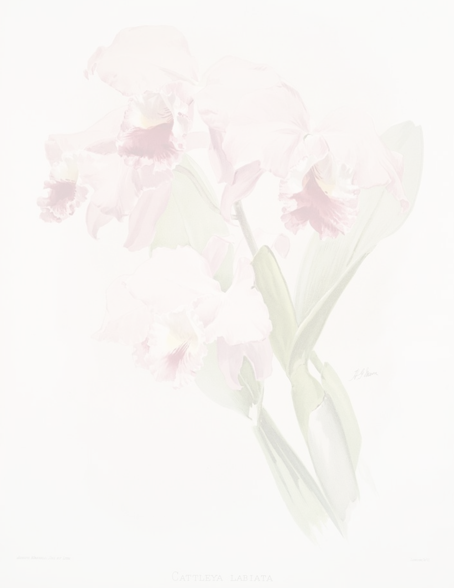

<!-- Orchid Banner -->

<!-- Name & title in elegant serif via capsule-render -->

<!-- Typing animation -->

 
Show Image
Show Image
Show Image

✦ about me
pythonliya = {
    "name":       "Kataliya Sungkamee",
    "education":  "CS + Marketing @ San Francisco State University '26",
    "currently":  ["job hunting 👀", "building cool things", "drinking too much matcha"],
    "interests":  ["full-stack dev", "ux research", "beauty & luxury tech", "human-centered design"],
    "fun_fact":   "grew up in a thai restaurant kitchen 🍜 → now i code and create content"
}
I'm a double major in Computer Science & Marketing with a love for building things that sit at the intersection of tech, design, and people. Whether I'm architecting a database schema, interviewing maritime workers for design research, or scripting a TikTok — I'm always thinking about the human behind the experience.

✦ tech stack

languages
Show Image
Show Image
Show Image
Show Image
Show Image
Show Image
frameworks & tools
Show Image
Show Image
Show Image
Show Image
Show Image
Show Image
Show Image
ai & data
Show Image
Show Image

✦ featured projects
<table>
  <tr>
    <td width="50%" valign="top">
      <h3>🐊 GatorAid</h3>
      
A peer tutoring platform built for SFSU students. Full-stack web app with token-based auth, RESTful API, and a clean EJS/Tailwind frontend.

      

        
        
        
      

    </td>
    <td width="50%" valign="top">
      <h3>🛍️ Retail Database System</h3>
      
30+ table MySQL retail schema with advanced return management, stored procedures, triggers, views, and a custom Python ORM using the Active Record pattern.

      

        
        
      

    </td>
  </tr>
  <tr>
    <td width="50%" valign="top">
      <h3>🤖 LLM Coding Agent</h3>
      
Autonomous coding agent powered by Qwen2.5 via llama-cpp-python. Capable of writing, executing, and debugging code end-to-end without human prompting.

      

        
        
      

    </td>
    <td width="50%" valign="top">
      <h3>🌊 Maritime Wellbeing Research</h3>
      
Design research initiative through the SUGAR Network (SFSU × École des Ponts × Deep Blue Foundation) — interviewing seafarers and synthesizing insights on workforce wellbeing.

      

        
        
      

    </td>
  </tr>
</table>

✦ github stats

  
  

  

"design everything like someone's going to feel it"

